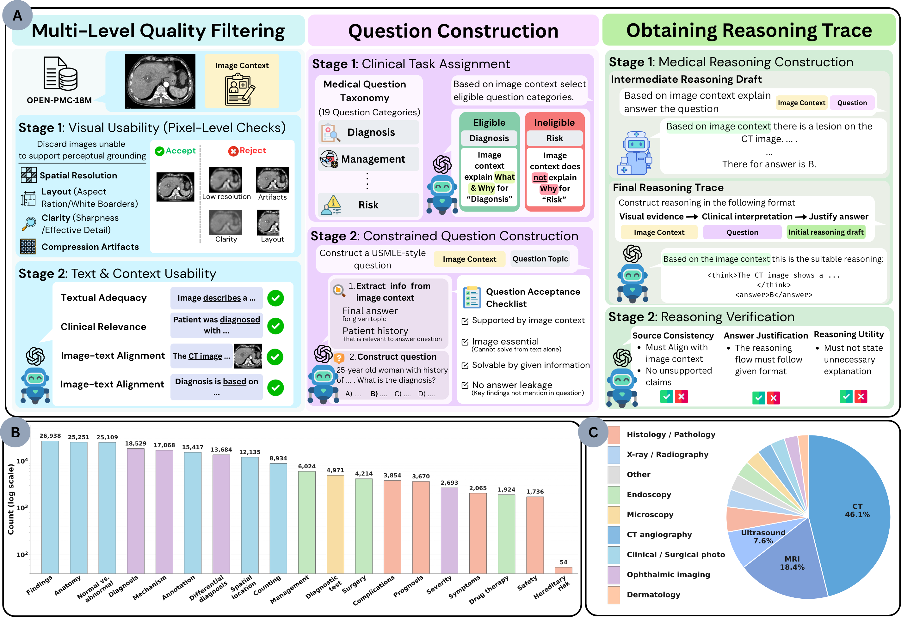

# BioReasonMed

This repository contains the code for the BioReasonMed pipeline and training framework.



## Repository Structure

```
clean_release/
├── pipeline/               # Data curation pipeline (Steps 1 → 2 → 2b → 3 → 4 → 5 → 6 → 7)
│   ├── 1_filter.py                      # Step 1:  Image quality and text quality filtering
│   ├── 2_select_relevant_context.py     # Step 2:  Extract relevant context & assign modality
│   ├── 2b_assign_question_categories.py # Step 2b: Assign clinical question categories
│   ├── 3_generate_mcq.py                # Step 3:  Generate MCQs per category
│   ├── 4_generate_reasoning.py          # Step 4:  Generate reasoning traces (OctoMed)
│   ├── 5_refine_reasoning.py            # Step 5:  Refine reasoning traces (GPT-4o / o-series)
│   ├── 6_extract_unit_questions.py      # Step 6:  Extract yes/no unit-question rubric
│   ├── 7_judge_unit_questions.py        # Step 7:  Run model + score with PKR judges
│   ├── prompts.py                       # Prompt templates for all pipeline steps
│   ├── cfg/
│   │   ├── 1_filter.yaml
│   │   ├── 2_select_relevant_context.yaml
│   │   ├── 2b_assign_question_categories.yaml
│   │   ├── 3_generate_mcq.yaml
│   │   ├── 4_generate_reasoning.yaml
│   │   ├── 5_refine_reasoning.yaml
│   │   ├── 6_extract_unit_questions.yaml
│   │   └── 7_judge_unit_questions.yaml
│   └── scripts/
│       ├── 1_filter.sh
│       ├── 2_select_relevant_context.sh
│       ├── 2b_assign_question_categories.sh
│       ├── 3_generate_mcq.sh
│       ├── 4_generate_reasoning.sh
│       ├── 5_refine_reasoning.sh
│       ├── 6_extract_unit_questions.sh
│       └── 7_judge_unit_questions.sh
└── train/                  # Training framework (SFT & GRPO)
    ├── scripts/
    │   ├── sft.sh          # SLURM launch script for SFT
    │   ├── grpo.sh         # SLURM launch script for GRPO
    │   └── zero3.json      # DeepSpeed ZeRO-3 config
    └── src/                # Python training source (add to PYTHONPATH)
        ├── train/
        │   ├── train_sft.py
        │   ├── train_grpo.py
        │   ├── reward_funcs.py
        │   └── train_utils.py
        ├── trainer/
        │   ├── sft_trainer.py
        │   └── grpo_trainer.py
        ├── dataset/
        │   ├── sft_dataset.py
        │   ├── grpo_dataset.py
        │   └── data_utils.py
        ├── model/
        │   └── load_model.py
        ├── params.py
        ├── utils.py
        └── constants.py
```

## Pipeline

### Step 1: Data Filtering (`pipeline/1_filter.py`)

Applies two sequential filters to a medical image-text dataset:

1. **Image quality filter** — removes images that are too small, have extreme aspect ratios, too much white border, or are blurry/low-resolution.
2. **Context quality filter** — uses a local LLM (e.g. Qwen3-8B via vLLM) to keep only entries whose text contains sufficient reasoning signals for VQA.

**Configuration:** `pipeline/cfg/1_filter.yaml`

**Run (SLURM array):**
```bash
sbatch pipeline/scripts/1_filter.sh
```

**Run (single process):**
```bash
cd <repo_root>
python pipeline/1_filter.py --config pipeline/cfg/1_filter.yaml
```

### Step 3: MCQ Generation (`pipeline/3_generate_mcq.py`)

Generates one USMLE-style MCQ per (row, category, style) triple using the system prompt from the paper.

**Key design decisions per MCQ:**
- **Style** — `short` (one-sentence image-forward stem) or `long` (clinical vignette with real context). Determined per category: some categories are short-only (e.g. *Anatomy / localization*, *Counting*, *Annotation / marker interpretation*), others are long-only (e.g. *Next-step treatment*, *Drug therapy*), and the rest produce both.
- **Image scope** — `subfigure` (default) or `full_figure` (stochastically sampled at `full_figure_ratio`).
- **Answer format** — `standard` (4–5 options), `binary_yesno`, `binary_truefalse`, or `binary_normal_abnormal`. Binary formats are sampled for eligible categories at `binary_ratio`.

The `__INVALID__` gate in the system prompt causes the model to skip categories it cannot ground properly, so the output `generated_mcq` list may be shorter than the input `categories` list.

**Configuration:** `pipeline/cfg/3_generate_mcq.yaml`

**Run (SLURM array):**
```bash
export OPENAI_API_KEY="your-api-key"
sbatch pipeline/scripts/3_generate_mcq.sh
```

**Output fields added per row:**
- `generated_mcq` — list of `{category, style, question, choices, answer, image_scope}` objects

---

### Step 4: Reasoning Trace Generation (`pipeline/4_generate_reasoning.py`)

Runs [OctoMed-7B](https://huggingface.co/OctoMed/OctoMed-7B) (a Qwen2.5-VL–based medical VLM) via **vLLM** to produce a structured reasoning trace for every MCQ generated in step 3.

For each MCQ the script:
- Selects image and context based on `image_scope`:
  - `subfigure` → `subfig_path` + `relevant_image_context` (fallback: `image_context`)
  - `full_figure` → `full_fig_path` + `image_context`
- Builds a prompt following the paper format: brief plan → **Perception** → **Clinical interpretation** → summary
- Generates `num_samples` candidates and keeps the first sample that predicts the correct answer letter; falls back to the first sample if none are correct.

**Requirements:** `vllm`, `transformers`, `Pillow`, `tqdm`, `pyyaml`

**Configuration:** `pipeline/cfg/4_generate_reasoning.yaml`

**Run (SLURM array):**
```bash
# Optional: set HF_HOME if model weights are in a non-default cache location
# export HF_HOME=/path/to/your/hf_cache
sbatch pipeline/scripts/4_generate_reasoning.sh
```

**Output fields added per MCQ object:**
- `reasoning` — full model output (`<think>...</think><answer>X</answer>`)
- `reasoning_predicted_letter` — parsed answer letter, or `null`
- `reasoning_matches_gold` — `true / false / null`
- `reasoning_context_source` — which context field was used
- `reasoning_image_path` — which image path was used

---

### Step 5: Reasoning Refinement (`pipeline/5_refine_reasoning.py`)

Rewrites the OctoMed draft reasoning from step 4 into a cleaner, fully grounded trace using a vision-language model (GPT-4o by default; compatible with o1/o3/o4 reasoning models).

The refinement prompt enforces a four-part structure inside `<think>`:
1. **Perception** — key image findings
2. **Clinical context** — relevant patient information from the question
3. **Clinical interpretation and medical knowledge** — how findings and context support the answer
4. Answer justification linking all three

Grounding rules prevent the model from citing the source context directly, inventing clinical details, or mentioning image annotations.

**Requirements:** Set `OPENAI_API_KEY` in your environment.

**Configuration:** `pipeline/cfg/5_refine_reasoning.yaml`

**Run (SLURM array — CPU only, no GPU needed):**
```bash
export OPENAI_API_KEY="your-api-key"
sbatch pipeline/scripts/5_refine_reasoning.sh
# Merge shards when all tasks finish:
cat /data/outputs/step5/with_refined_reasoning_task*.jsonl \
    > /data/outputs/step5/with_refined_reasoning.jsonl
```

**Output fields updated / added per MCQ object:**
- `reasoning_original` — draft from step 4
- `reasoning_original_predicted_letter` / `reasoning_original_matches_gold`
- `reasoning` — refined trace (`<think>...</think><answer>X</answer>`)
- `reasoning_predicted_letter` / `reasoning_matches_gold`
- `reasoning_refine_model`, `reasoning_refine_image_path`, `reasoning_refine_image_field`

---

### Step 6: Unit-Question Rubric Extraction (`pipeline/6_extract_unit_questions.py`)

Converts each refined reasoning trace from step 5 into a structured evaluation rubric of **yes/no unit questions**. The output is a **flat JSONL** — one row per MCQ (the nested `generated_mcq` list is unpacked).

Each unit covers exactly one piece of forward reasoning along one of three axes:

| Axis | What it captures |
|---|---|
| `observation` | Visible image findings the trace describes |
| `knowledge` | General medical facts the trace relies on |
| `inference` | Case-specific bridges from findings + facts to the conclusion |

Every unit carries **two probes** for independent judging:
- `presence_question` — *lenient*: did the model mention this topic at all?
- `correctness_question` — *strict*: did the model state the correct claim?

An anti-hallucination guard verifies that each unit's `source_quote` is a verbatim contiguous span of the source reasoning trace before accepting it.

**Requirements:** Set `OPENAI_API_KEY` in your environment. No GPU required.

**Configuration:** `pipeline/cfg/6_extract_unit_questions.yaml`

**Run (SLURM array — CPU only):**
```bash
export OPENAI_API_KEY="your-api-key"
sbatch pipeline/scripts/6_extract_unit_questions.sh
# Merge shards:
cat /data/outputs/step6/unit_questions_task*.jsonl \
    > /data/outputs/step6/unit_questions.jsonl
```

**Output fields per row:**
- `question`, `choices`, `answer`, `category`, `image_scope` — carried from MCQ
- `subfig_path`, `full_fig_path`, `modality` — carried from parent row
- `reference_cot` — the `<think>` block used as input
- `unit_questions` — list of `{unit_id, axis, topic, claim, presence_question, correctness_question, source_quote, importance}` objects
- `unit_questions_axis_counts` — `{observation, knowledge, inference}` counts
- `unit_questions_model` — model used

---

### Step 2b: Question Category Assignment (`pipeline/2b_assign_question_categories.py`)

Uses a vision-language model to classify each image-context pair into one or more of **20 clinical question categories** (e.g. *Diagnosis*, *Mechanism / pathophysiology explanation*, *Severity grading*, etc.) based on how well the context supports each category.

Full category list defined in `prompts.py` → `QUESTION_CATEGORY_TYPES`.

**Requirements:** Set `OPENAI_API_KEY` in your environment.

**Configuration:** `pipeline/cfg/2b_assign_question_categories.yaml`

**Run (SLURM array):**
```bash
export OPENAI_API_KEY="your-api-key"
sbatch pipeline/scripts/2b_assign_question_categories.sh
```

**Output fields added per row:**
- `categories` — list of matched category names (exact strings from the allowed list)

---

### Step 2: Relevant Context Selection (`pipeline/2_select_relevant_context.py`)

Uses a vision-language model (e.g. GPT-4o-mini) to:
- Extract from `image_context` only the passages that refer to the given subfigure.
- Assign `primary_modality` (e.g. Radiology, Microscopy) and `secondary_modality`.
- Mark each entry as `valid` or not.

**Requirements:** Set `OPENAI_API_KEY` in your environment.

**Configuration:** `pipeline/cfg/2_select_relevant_context.yaml`

**Run (SLURM array):**
```bash
export OPENAI_API_KEY="your-api-key"
sbatch pipeline/scripts/2_select_relevant_context.sh
```

## Training

### SFT (Supervised Fine-Tuning)

Trains a Qwen-VL model with LoRA using the SFT dataset.

**Configuration:** Set `MODEL_NAME`, `DATA_PATH`, `OUTPUT_DIR` in the environment or directly in `train/scripts/sft.sh`.

```bash
MODEL_NAME="Qwen/Qwen2.5-VL-7B-Instruct" \
DATA_PATH="/path/to/sft_train.json" \
OUTPUT_DIR="/path/to/checkpoints" \
sbatch train/scripts/sft.sh
```

### GRPO (Group Relative Policy Optimization)

Reinforcement learning from reward functions. Expects a pre-merged model checkpoint (not a raw LoRA adapter) as the starting point.

```bash
MODEL_NAME="/path/to/merged-sft-checkpoint" \
DATA_PATH="/path/to/grpo_train.json" \
OUTPUT_DIR="/path/to/grpo-checkpoints" \
sbatch train/scripts/grpo.sh
```

### Reward Functions

Defined in `train/src/train/reward_funcs.py`:
- `accuracy_reward` — checks whether the model's answer matches the ground truth (supports LaTeX/symbolic math via `math_verify`).
- `format_reward` — checks whether the output follows the `<think>...</think><answer>...</answer>` format.

---

### Step 7 — Judge Unit Questions (`7_judge_unit_questions.py`)

Runs a model under test on the step-6 flat rubric and scores each unit
with three independent judges, one per reasoning layer.

**What it does:**
1. Loads the step-6 output (one row per MCQ with a `unit_questions` list).
2. Runs the model *N* times (`num_runs`) per row to capture response
   diversity. Supports three inference backends:
   - `vllm` — local GPU model served via vLLM (default, e.g. OctoMed-7B or a fine-tuned checkpoint).
   - `openai` — any OpenAI-compatible chat-completions endpoint (no GPU required).
   - `anthropic` — Anthropic messages API (no GPU required).
3. Scores each response against the rubric with three judges:
   - **Perception judge** (VLM, sees the image) — scores `observation` units.
   - **Knowledge judge** (text LLM) — scores `knowledge` units.
   - **Reasoning judge** (text LLM) — scores `inference` units.
4. Per unit, each judge returns two axes:
   - `presence` ∈ {0, 1, 2} — absent / partial / clearly asserted.
   - `correctness` ∈ {-1, 0, 1} — wrong / N/A / correct.
5. Tags each unit deterministically with a failure mode:
   `omission`, `factual_error`, `chain_break`,
   `option_elimination`, `judge_error`, or `ok`.
6. Aggregates per-run and corpus-level metrics and writes a summary JSON.

**Configuration** (`cfg/7_judge_unit_questions.yaml`):
| key | meaning |
|---|---|
| `inference_backend` | `vllm` / `openai` / `anthropic` |
| `model_id` | HuggingFace model name or API model name |
| `perception/knowledge/reasoning_judge_model` | judge models (e.g. `gpt-4o`) |
| `num_runs` | independent samples per row (default 5) |
| `judge_reasoning_effort` | `low`/`medium`/`high` for o1-class judges |
| `save_evidence` | whether to store judge evidence strings |

**Outputs per run record:**
| field | type | description |
|---|---|---|
| `id`, `run` | str, int | row ID and run index |
| `model_raw_answer` | str | full model output |
| `model_answer_letter` | str | extracted answer letter |
| `mc_correct` | bool | letter matches reference |
| `judge_perception` | list | per-unit perception scores |
| `judge_knowledge` | list | per-unit knowledge scores |
| `judge_reasoning` | list | per-unit reasoning scores |
| `chain_grounding` | list | deterministic premise grounding per reasoning unit |
| `per_layer_metrics` | dict | presence_mean, correctness_rate |
| `failure_mode_histogram` | dict | failure tag counts per layer |

**Run:**
```bash
# Single process
python pipeline/7_judge_unit_questions.py \
    --config pipeline/cfg/7_judge_unit_questions.yaml

# SLURM array (sharded across 8 tasks)
export OPENAI_API_KEY="sk-..."
sbatch --array=0-7 pipeline/scripts/7_judge_unit_questions.sh

# Merge shards
cat /data/outputs/step7/runs_task*.jsonl > /data/outputs/step7/runs.jsonl
```

---

## Requirements

```
torch
transformers
trl
peft
deepspeed
opencv-python
Pillow
pandas
ujson
vllm          # optional, for Step 1 context quality filter
openai        # for Step 2
tqdm
yaml
```

## Citation

If you use this code, please cite our paper (coming soon).
